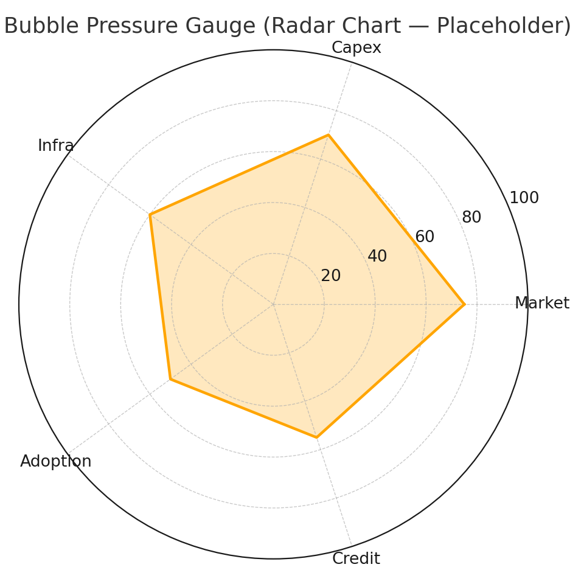
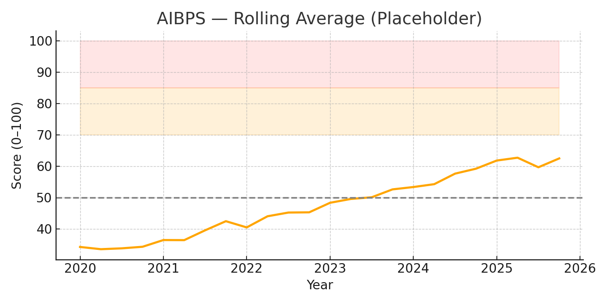
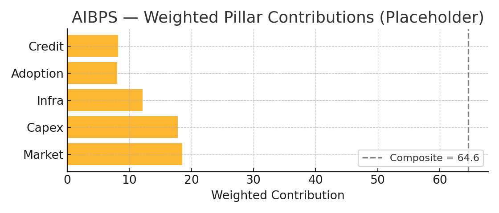

# 🧠 AI Bubble Pressure Score (AIBPS) — v0.1

[](https://www.python.org/)
[](https://streamlit.io)
[](LICENSE)

An **interactive analytics framework** for measuring, visualizing, and tracking the buildup of a potential **AI-driven economic bubble** — across **market valuations, capital expenditure, infrastructure constraints, adoption, and credit conditions**.

This repository powers the **AI Bubble Pressure Score (AIBPS)** — a 0–100 composite indicator that integrates data from semiconductors, hyperscaler capex, data center infrastructure, cloud AI revenues, and credit spreads.

---

## 🚀 Try it online

You can deploy this dashboard directly using **[Streamlit Community Cloud](https://streamlit.io/cloud)** — just click below:

[](https://share.streamlit.io/mjmonnot/aibps-v0-1/app/streamlit_app.py)

---

## 🧩 Features

- 📊 **Composite Index:** Weighted, percentile-based scoring across five pillars:
  - Market Valuations  
  - Capex & Supply Chain  
  - Infrastructure (Power, Data Centers)  
  - Adoption & Productivity  
  - Credit & Liquidity  

- ⚙️ **Interactive Weight Controls:** Adjust pillar weights in real-time via sliders  
- 🧾 **Chartbook Export:** One-click PDF generation (rolling average + contribution charts)  
- 🕰️ **Historical Backfill:** 10-year window using public data from FRED, Yahoo Finance, and company filings  
- 🧠 **Extensible Framework:** Add manual CSVs for capex, book-to-bill, or interconnection queues  

---

## 🏗️ Project Structure
```
aibps-v0-1/
├── app/
│   └── streamlit_app.py          # interactive dashboard
├── src/aibps/
│   ├── compute.py                # normalization, weighting, composite calc
│   ├── fetch_market.py           # yfinance market proxies
│   ├── fetch_credit.py           # FRED credit spreads
│   ├── config.yaml               # indicator config & weights
│   └── visualize.py              # radar & chartbook helpers
├── data/
│   ├── sample/                   # offline sample data for demo
│   ├── raw/                      # pull raw market/credit CSVs
│   └── processed/                # computed composite outputs
├── .github/workflows/            # linting & CI
├── requirements.txt
├── LICENSE
└── README.md

---

## 🧠 Quickstart (local)

```bash
# Clone and enter
git clone https://github.com/mjmonnot/aibps-v0-1.git
cd aibps-v0-1

# Create environment
python -m venv .venv
source .venv/bin/activate  # Windows: .venv\Scripts\activate

# Install dependencies
pip install -r requirements.txt

# (Optional) Set your FRED API key
export FRED_API_KEY=your_key_here

# Run the dashboard
streamlit run app/streamlit_app.py

## 📈 Example Output

| Visualization | Description |
|----------------|-------------|
|  | Multi-pillar “pressure gauge” for bubble buildup |
|  | Rolling average of AIBPS (2020–2025) with risk bands |
|  | Weighted contribution of each pillar |

## 📚 Data Sources (planned)

- FRED API — Credit spreads (HY/IG OAS)
- Yahoo Finance — SOXX, QQQ, NVDA, MSFT, META, AMZN, GOOGL
- Company filings (SEC EDGAR) — Capex & AI-related disclosures
- SEMI.org — Semiconductor equipment book-to-bill
- CBRE, JLL, ISO queue data — Power & DC capacity
- Cloud provider financial reports — AI revenue attribution

## 🧑‍💻 Contributing

Contributions are welcome!
Submit pull requests for:
- New indicators or data pipelines
- Visualization improvements
- Streamlit UX upgrades

## 🪪 License

MIT License © 2025  
See the LICENSE file for details.

