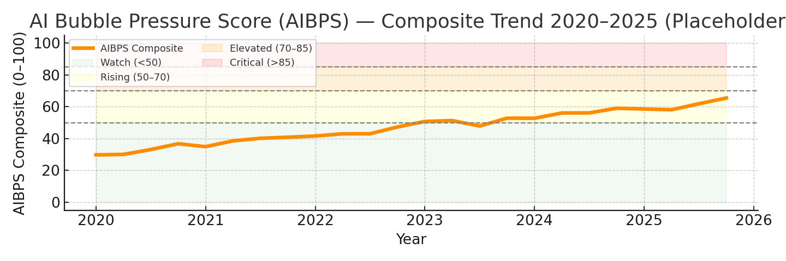

# 🧭 AIBPS Overview — Understanding the AI Bubble Pressure Score

The **AI Bubble Pressure Score (AIBPS)** is a composite early-warning indicator designed to measure the structural overheating of the AI-driven investment cycle.  
It integrates economic, financial-market, and technological-infrastructure signals into a unified 0–100 scale that can be tracked over time.

---

## 🎯 Purpose

To provide a **systematic, data-driven view** of whether current AI-related investment and market activity are approaching levels historically associated with unsustainable bubbles.

The AIBPS framework does **not** predict collapse; instead, it measures *pressure buildup* — the combination of valuation excess, capital intensity, and speculative reflexivity that often precede market corrections.

---

## ⚙️ Methodology

The index aggregates ~20 indicators across five structural pillars, each normalized to percentile scores over a ten-year window:

| Pillar | Description | Example Indicators |
|--------|--------------|--------------------|
| **Market Valuations** | Equity performance, multiples, and option sentiment | SOXX / QQQ returns, EV/Sales z-scores, options skew |
| **Capex & Supply Chain** | Investment intensity in semiconductors and hyperscaler infrastructure | Hyperscaler capex/revenue %, SEMI book-to-bill, HBM output |
| **Infrastructure (Power & Data Centers)** | Physical constraints and demand saturation | Interconnection queues, DC vacancy rates, rent growth |
| **Adoption & Productivity** | Real-economy utilization and ROI of AI tools | Cloud AI revenue growth, enterprise token usage, labor productivity |
| **Credit & Liquidity** | Financing conditions and speculative leverage | HY/IG spreads, venture volumes, margin debt |

Each pillar contributes a weighted share to the total AIBPS composite, defaulting to:

> Market 25% • Capex 25% • Infra 20% • Adoption 15% • Credit 15%

---

## 🔢 Scoring Interpretation

| Composite Range | Zone | Interpretation |
|-----------------|------|----------------|
| **0 – 50** | 🟢 Watch | Normal expansion; valuations supported by fundamentals |
| **50 – 70** | 🟡 Rising Pressure | Early-cycle exuberance; monitoring warranted |
| **70 – 85** | 🟠 Elevated Risk | Late-cycle acceleration; reflexivity increasing |
| **> 85** | 🔴 Critical Zone | Bubble-like dynamics; vulnerability to correction |

---

## 🧮 Data Handling

- **Normalization:** Percentile or inverted-percentile transformation (depending on risk direction).  
- **Frequency:** Monthly composite, updated quarterly as data lags resolve.  
- **Sources:** FRED API, Yahoo Finance, SEC EDGAR filings, SEMI Book-to-Bill, CBRE/JLL market data, cloud provider financials.

Missing or proprietary series can be supplemented manually via CSV inputs (`/data/raw/`).

---

## 📊 Dashboard Interaction

Within the Streamlit app:
- Adjust pillar weights interactively via sliders.  
- Observe the **3-quarter rolling average** for smoother trends.  
- Export the **Chartbook PDF** with time-series and contribution visuals.

---

## 🧠 Interpretation Notes

- A rising AIBPS does not guarantee a crash — it highlights **systemic concentration** of speculative capital.  
- Persistent readings above 80 often coincide with over-build phases (dot-com 1999–2000, housing 2006–2007).  
- The framework is adaptive; indicators and weights can evolve as new AI sub-sectors emerge (e.g., inference hardware, synthetic data markets, AI-driven energy demand).

---

## 🪪 License & Citation

This work is released under the [MIT License](../LICENSE).

If referencing this project in research or media, please cite as:

> Monnot, M. J. (2025). *AI Bubble Pressure Score (AIBPS): A Composite Indicator for AI-Driven Market Cycles.*  
> GitHub Repository: https://github.com/<your-username>/aibps-v0-1

